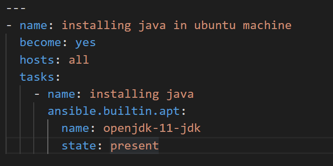
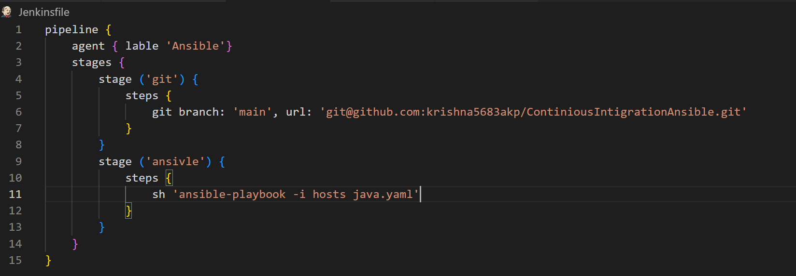

# ContiniousIntigrationAnsible

### Installing Java11 on Ubuntu machine

* First i have created a Jenkins machine and in that machine i have installed ansible.So, this machine became ansible master now.
* Then i have created another ubuntu machine and added that machine to the ansible control plane so this machine became ansible node.
* I have written a playbook to install java11 on node 
  
* I have written a Jenkinsfile to execute ansible steps 
  